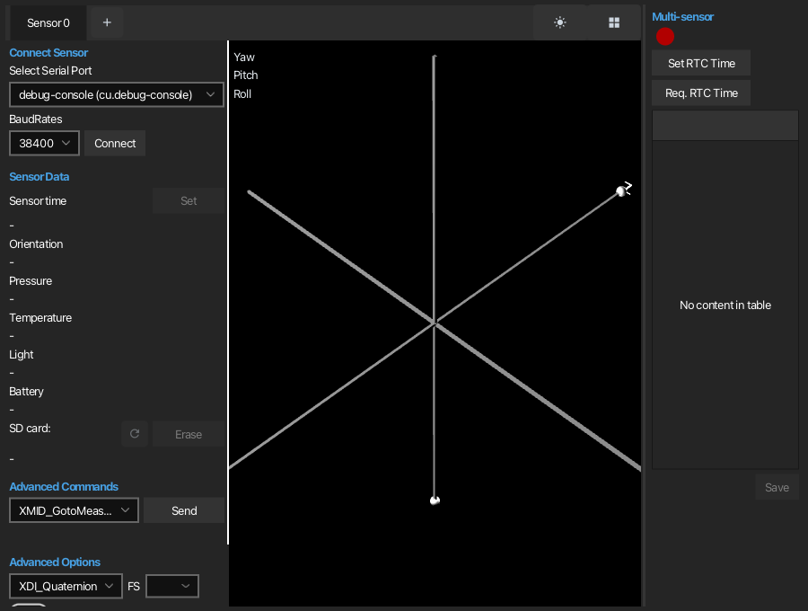
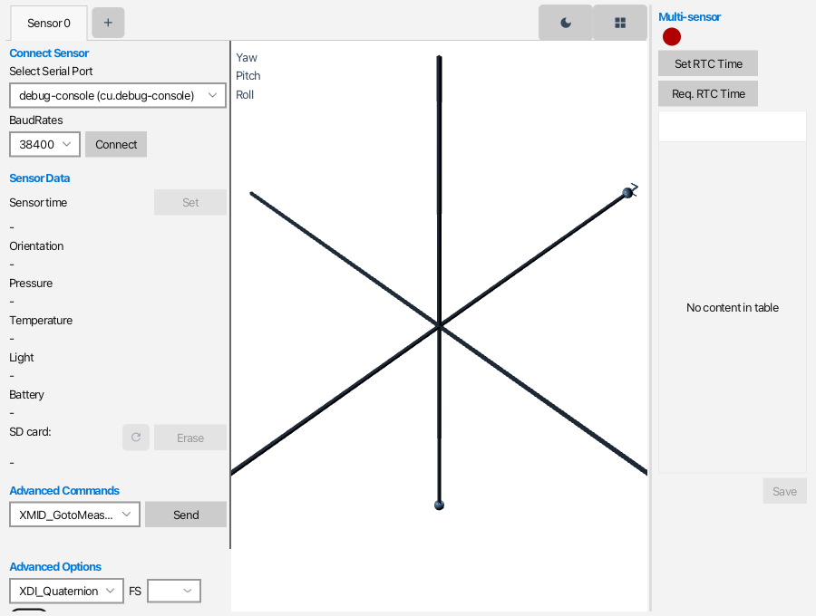
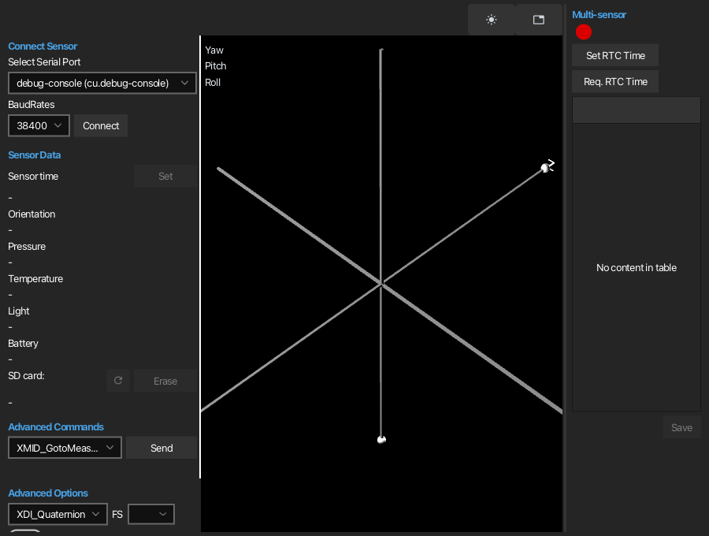

# SoundNet Sensor Viewer

A desktop application for connecting to [SoundNet](https://github.com/Sound-Net) sensor
packages over USB serial, watching their output live, and sending them commands.

Each sensor gets its own tab: pick a serial port, connect, and orientation, pressure,
temperature, light spectrum, battery and SD card state stream in while the sensor
package is drawn in 3D from its own orientation data.



## Features

- **Live sensor readout** - sensor time, orientation (Euler angles or quaternion),
  pressure, temperature, light spectrum, battery level and SD card usage.
- **3D view** - the sensor package rendered from its live orientation, using the
  mesh for the device type it reports (SensLogger V1, SoundNet V1 R5, SoundNet V2 R1).
- **Several sensors at once** - one tab per sensor, each with its own serial
  connection. Tabs can be torn off into their own windows.
- **Tabbed or tiled layout** - swap with the button in the top right corner.
- **Multi-sensor commands** - set or request the real-time clock across every
  connected sensor at once, and save the results.
- **Advanced commands** - send any XMID message (`XMID_GotoMeasurement`,
  `XMID_ReqSDSize`, `XMID_ReqFirmwareVersion` and the rest) and choose the data
  output format.
- **Light and dark themes** - the sun/moon button in the top right corner switches
  between them, including any torn-off windows. The choice is remembered between
  runs.

| Light | Tiled layout |
| --- | --- |
|  |  |

## Installing

Tagged releases build installers for Windows, macOS and Linux. Download the one for
your platform from the repository's Releases page:

| Platform | Installer | Also available |
| --- | --- | --- |
| Windows | `.exe` (NSIS, per-user, no admin rights) or `.msi` | portable app image |
| macOS | `.dmg` | portable app image |
| Linux | `.deb` | portable app image |

Every installer bundles its own Java runtime, so nothing needs to be installed first.
The portable app image is an unzip-and-run folder, for machines where installers are
locked down.

## Building from source

The Maven project lives in the `xsensViewer/` subdirectory.

Requirements:

- JDK 17 or later (the release workflow builds on JDK 21)
- Maven

Build the jar and the staged application layout:

```bash
cd xsensViewer && mvn package
```

Run it:

```bash
cd xsensViewer && mvn javafx:run
```

`mvn package` writes:

- `target/xsensviewer.jar` - the thin jar
- `target/app/` - the jar plus every dependency, which is what `jpackage` consumes

On Windows, the `win` profile activates automatically and also produces
`target/dist/app-image/` and a single-file NSIS installer in
`target/dist/installer/`.

### Building an installer by hand

`jpackage` is not a cross-compiler - a Windows installer can only be built on
Windows, a `.dmg` only on macOS. After `mvn package`:

```bash
jpackage --type dmg --name "SoundNet Sensor Viewer" --app-version 1.0.0 --vendor "SoundNet" --input target/app --main-jar xsensviewer.jar --main-class main.SensorMainLauncher --icon packaging/icon.icns --dest target/installer
```

Substitute `msi`/`deb` and the matching icon from `packaging/` for the other
platforms. This is what `.github/workflows/release.yml` runs on a `v*` tag, across
a Windows/macOS/Linux matrix.

## Project layout

```
xsensViewer/
  src/
    main/     application entry point and the sensor control classes
    comms/    serial port handling and message parsing
    xsens/    XBus/XMID message definitions and encoding
    layout/   the JavaFX user interface
      utils/  tab pane, icons and other shared widgets
    resources/ 3D meshes for the sensor packages, and the app icon
    style.css  the application's own colours, layered on the Transit theme
  packaging/  installer icons and the NSIS installer template
  tools/      make-icons.py, which generates the icons from the master artwork
```

## Theming

Control styling comes from [Transit](https://github.com/dukke/Transit); `style.css`
layers this application's own colours on top. Both are kept deliberately in step
with the SoundNet Firmware Updater so the two applications read as one product -
class names and colours should be changed in both or neither.

Transit's dark style does not restate the inherited Modena text colours, so anything
this application colours itself needs a matching `.dark` rule in `style.css`.
